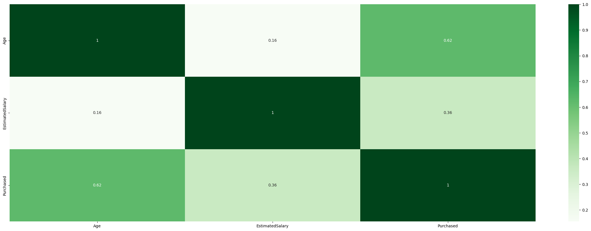

# classification

This notebook tests the different performances of classification algorithms on a simple dataset called Social Network Advertisements containing various financial details of the customers, and also specifies if a customer bought the advertised product or not.

The dataset has been pre-processed with an idea to get the optimal performance from the models. The Correlation Matrix looks as follows.

The following classification models have been tested:

1. __Logistic Regression Classifier__  
2. __Naive Bayes Classifier__  
3. __K-Nearest Neighbors Classifier__  
4. __Decision Tree Classifier__  
5. __Random Forest Classifier__  
6. __Support Vector Machine Classifier__  

### __Environment__
Python 3+

__Run__
    
Download all the dependencies.
    
    pip install -r requirements.txt

 

    Run the Jupyter Notebook.