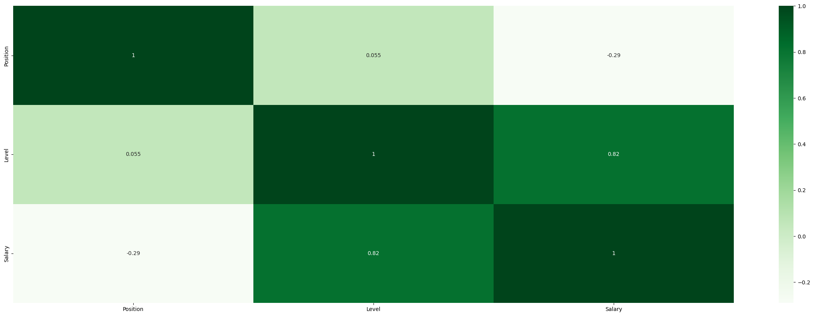

# regression

This notebook tests the different performances of regression algorithms on a simple dataset called Position Salaries that defines the salary of a an employee at different levels in the organization.

The dataset has been pre-processed with an idea to get the optimal performance from the models. The Correlation Matrix looks as follows.

The following regression models have been tested:

1. __Linear Regression__  
2. __Polynomial Regression__  
3. __Decision Tree Regression__  
4. __Random Forest Regression__  
5. __Support Vector Machine Regression__  

### __Environment__
Python 3+

__Run__
    
Download all the dependencies.
    
    pip install -r requirements.txt

 

    Run the Jupyter Notebook.