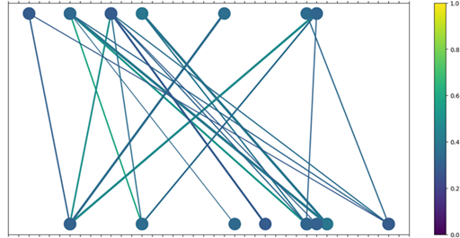

# association

This notebook tests the different Association Rules on a Market Basket Dataset that contains 9000+ transactions done by customers for groceries. The task is to implement Associations on the items to see which of them are mostly bought together.

The dataset has been pre-processed with an idea to get the optimal performance from the models. The following is the association output.

  

 

The following regression models have been tested:

1. __Apriori__  
2. __Eclat__ (process)  

### __Environment__
Python 3+

__Run__
    
Download all the dependencies.
    
    pip install -r requirements.txt

 

    Run the Jupyter Notebook.